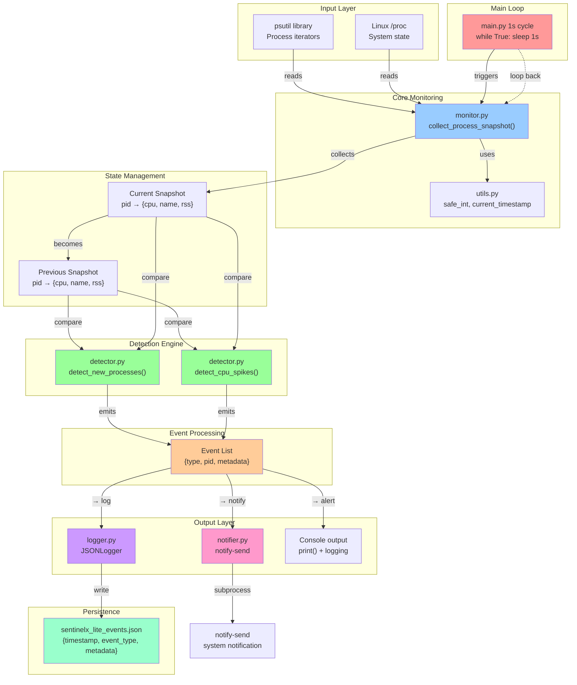

# SentinelX-Lite Architecture & Design

## System Overview

`SentinelX-Lite` is a behavioral process monitoring tool for Linux. This document tracks the evolving architecture as features are added.

---

## Current System Architecture (MVP - v1.0)

---

## Module Breakdown

### `main.py` (Orchestrator)
- **Role**: Entry point, 1-second monitoring loop, signal handling
- **Key functions**:
  - `run_monitor()`: Main loop
  - `print_alert(event)`: Format and emit alerts
  - `signal_handler(signum, frame)`: SIGINT/SIGTERM graceful shutdown
- **Why it works**: Centralizes control flow; easy to add CLI args, config later
- **Dependencies**: All other modules

### `monitor.py` (Data Collection)
- **Role**: Gather live process snapshots from psutil
- **Key functions**:
  - `collect_process_snapshot()`: Returns `dict[pid -> {pid, name, cpu_percent, rss}]`
- **Why it works**: 
  - Abstracts psutil complexity 
  - Exception-safe (handles `NoSuchProcess`, `AccessDenied`, `ZombieProcess`)
  - One clean return per cycle
- **Dependencies**: psutil, utils

### `detector.py` (Anomaly Detection)
- **Role**: Compare snapshots and emit behavioral events
- **Key functions**:
  - `detect_new_processes(prev, curr)`: Find PIDs in curr but not in prev
  - `detect_cpu_spikes(prev, curr, threshold=50.0)`: Detect CPU delta > threshold
- **Why it works**: 
  - Pure comparison logic, no state mutation
  - Thresholds tunable
  - Extensible for new rules
- **Dependencies**: None (pure functions)

### `logger.py` (Event Persistence)
- **Role**: Write structured event log to JSON file
- **Key functions**:
  - `JSONLogger(path)`: Initialize or create log file
  - `log_event(event_type, metadata)`: Append event to JSON
- **Why it works**: 
  - Reads existing JSON, appends, writes back (not streaming)
  - Handles corrupted JSON fallback to `[]`
  - ISO-UTC timestamps for sorting/correlation
- **Dependencies**: utils

### `notifier.py` (System Alerts)
- **Role**: Send desktop notifications via `notify-send`
- **Key functions**:
  - `send_notification(title, message)`: subprocess call
- **Why it works**: 
  - Non-blocking (subprocess)
  - Graceful fallback if `notify-send` missing
  - Exception-safe
- **Dependencies**: subprocess (stdlib)

### `utils.py` (Helpers)
- **Role**: Shared utilities
- **Key functions**:
  - `current_timestamp()`: ISO-UTC string
  - `safe_int(value)`: Guard int conversion
- **Why it works**: DRY principle; used across modules
- **Dependencies**: datetime (stdlib)

---

## Data Flow & Why It Works

1. **Initialization**
   - `main.py` starts
   - `collect_process_snapshot()` gets initial state (PREV)
   - Logging configured (CLI + file)

2. **Each 1-second cycle**
   - `collect_process_snapshot()` → CURR
   - `detect_new_processes(PREV, CURR)` → new PIDs → events
   - `detect_cpu_spikes(PREV, CURR, 50%)` → CPU deltas → events
   - For each event:
     - **CLI**: `print()` + `logging.warning()`
     - **Persistence**: `JSONLogger.log_event()`
     - **Notification**: `notify-send` (async subprocess)
   - CURR becomes PREV
   - `sleep(1.0)`

3. **Robustness**
   - Process collection is exception-safe
   - Event detection is stateless (pure functions)
   - Logging is fault-tolerant (JSON recovery)
   - Notification failures don't block monitoring

---

## Why This Design Is System-Level

- **Low-level**: Uses psutil to access `/proc` via C bindings
- **Behavioral**: Compares state snapshots (not signatures)
- **Responsive**: 1-second polling with immediate alerts
- **Modular**: Each module does one job well
- **Extensible**: Easy to add memory rules, file monitoring, network tracking

---

## Version History

| Version | Date | Changes |
|---------|------|---------|
| v1.11 | 2026-03-25 | Threat classification: categorized alerts (PROCESS_SPAWN_ABUSE, CPU_INTENSIVE_PROCESS, etc.) |
| v1.10 | 2026-03-25 | Threat scoring engine: multi-signal correlation, parent-based scoring, unified decision layer |
| v1.9 | 2026-03-25 | CPU state machine: edge detection instead of level detection, alert only on transitions |
| v1.8 | 2026-03-25 | Noise filtering: CPU stabilization (3-cycle), process filtering, kernel noise elimination, smarter new process alerts |
| v1.7 | 2026-03-25 | Burst alert spam fix: one alert per time window, comprehensive cleanup |
| v1.6 | 2026-03-25 | Time-window burst detection: spawn history tracking, rate-based alerts, low-CPU filtering |
| v1.5 | 2026-03-25 | Precise correlation: CPU stats (total/max/avg), quality+intensity logic, system parent filtering |
| v1.4 | 2026-03-25 | Multi-signal correlation: parent CPU calculation, correlated activity detection (spawn burst + high CPU) |
| v1.3 | 2026-03-25 | Temporal spawn detection: track previous tree state, detect only NEW children within time window (not total children) |
| v1.2 | 2026-03-25 | Process relationships: ppid tracking, process tree builder, spawn burst detection (threshold=5 children) |
| v1.1 | 2026-03-25 | Critical fixes: CPU detection (absolute threshold), logging (JSONL append-only), process identity (create_time), alert cooldown (5s per-PID) |
| v1.0 | 2026-03-25 | MVP: new process + CPU spike detection |

---

## Changelog

### v1.11 (2026-03-25) - Threat Classification
- **Added**: `classify_threat()` function for behavioral categorization
- **Implemented**: Categorized threat alerts (PROCESS_SPAWN_ABUSE, CPU_INTENSIVE_PROCESS, etc.)
- **Enhanced**: Threat messages now include meaningful behavior labels
- **Updated**: THREAT event logging includes category field

### v1.10 (2026-03-25) - Unified Threat Scoring Engine
- **Added**: Parent-based signal tracking system (burst, cpu, file signals per parent)
- **Implemented**: Multi-signal correlation with scoring function (burst+3, cpu+3, file+4)
- **Added**: Final decision layer with ALERT_THRESHOLD = 5
- **Added**: [THREAT] alerts for high-scoring parent processes
- **Preserved**: All low-level telemetry (CPU logs, burst logs) for debugging

### v1.9 (2026-03-25) - CPU State Machine
- **Added**: CPU alert state tracking with edge detection instead of level detection
- **Implemented**: Alert only on state transitions (not alerted → alerted)
- **Added**: Alert state reset when CPU drops below 30%
- **Fixed**: Repeated alerts for fluctuating CPU usage (state flapping)

### v1.8 (2026-03-25) - Noise Filtering & Stabilization
- **Added**: CPU spike stabilization requiring 3 consecutive cycles above threshold
- **Added**: Process name filtering to ignore harmless processes (sleep, kworker, cpuUsage.sh)
- **Added**: Kernel noise elimination (ppid 0,1,2 and zero-memory processes)
- **Improved**: Smarter new process alerts (only high CPU >20% or burst-related)
- **Reduced**: False positive spam from system fluctuations and harmless processes

### v1.7 (2026-03-25) - Burst Alert Spam Fix
- **Fixed**: Burst alerts now trigger only once per 5-second time window per PID
- **Added**: `burst_alerted` global dictionary to track alert timestamps
- **Improved**: Alert logic prevents repeated notifications for the same spawning activity
- **Cleaned**: Comprehensive system cleanup for reliable testing

### v1.6 (2026-03-25) - Time-Window Burst Detection
- **Added**: Spawn history tracking with 5-second sliding window
- **Implemented**: Rate-based burst detection (threshold: 5+ spawns in 5s)
- **Enhanced**: Low-CPU filtering to reduce false positives
- **Improved**: Process tree analysis with temporal awareness

### v1.5 (2026-03-25) - Precise Correlation
- **Enhanced**: CPU statistics calculation (total/max/avg) for better correlation
- **Improved**: Correlation logic with quality+intensity scoring
- **Added**: System parent process filtering to reduce noise
- **Fixed**: More accurate behavioral pattern detection

### v1.4 (2026-03-25) - Multi-Signal Correlation
- **Added**: Parent process CPU calculation for correlation analysis
- **Implemented**: Correlated activity detection (spawn burst + high CPU)
- **Enhanced**: Multi-dimensional threat assessment
- **Improved**: Alert prioritization based on signal strength

### v1.3 (2026-03-25) - Temporal Spawn Detection
- **Fixed**: Track previous tree state to detect only NEW children
- **Improved**: Time-window based spawn analysis (not total children)
- **Enhanced**: More accurate burst detection logic
- **Reduced**: False positives from gradual spawning

### v1.2 (2026-03-25) - Process Relationships
- **Added**: PPID tracking for process hierarchy
- **Implemented**: Process tree builder function
- **Enhanced**: Spawn burst detection with threshold (5 children)
- **Improved**: Behavioral analysis with parent-child relationships

### v1.1 (2026-03-25) - Critical Fixes
- **Fixed**: CPU detection from delta-based to absolute threshold (>50%)
- **Changed**: Logging from JSON array rewrite to append-only JSONL
- **Added**: Process identity tracking with create_time
- **Implemented**: Alert cooldown system (5s per PID)

### v1.0 (2026-03-25) - MVP Release
- **Implemented**: Basic process monitoring (new processes + CPU spikes)
- **Added**: Modular architecture with separate concerns
- **Created**: JSON logging and system notifications
- **Established**: 1-second monitoring loop foundation

---

## Future Enhancements (Design Flexible For)

- [ ] Memory growth anomaly detection
- [ ] Process state transition tracking
- [ ] File descriptor anomalies
- [ ] Network socket monitoring
- [ ] Process tree (parent-child) relationships
- [ ] Behavior correlation engine
- [ ] CLI args (--threshold, --log-file, --no-notify)
- [ ] Config file support (YAML/JSON)
- [ ] strace integration for system call analysis
- [ ] eBPF-based kernel-level monitoring
